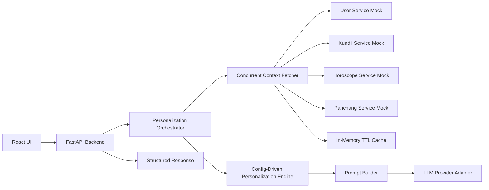

# MyNaksh Personalized AI Context Engine - Detailed Plan

## 1. Goal

Build a proof-of-concept backend service that demonstrates the intelligence layer between structured astrology services and an LLM.

The core deliverable is not another chatbot. The core deliverable is a configurable Personalization Engine that:

- Fetches structured user context from multiple upstream services.
- Detects the user's intent.
- Selects only relevant context for that intent.
- Applies user profile preferences for language, tone, and response length.
- Builds a compact grounded prompt.
- Calls a swappable LLM provider, or a mock provider if no key/local model is available.
- Returns a structured answer with confidence and sources used.

Primary required endpoint:

```http
POST /personalize
```

Required debug endpoint:

```http
POST /debug/personalization
```

This project should be treated as a POC, so the design should be clean and extensible without overbuilding production infrastructure.

## 2. Proposed Tech Stack

### Backend

- Python 3.11+
- FastAPI for API endpoints
- Pydantic for request/response/config models
- httpx for async upstream service calls
- tenacity or a small custom retry helper for retries
- cachetools or a small custom TTL cache for in-memory caching
- structlog or standard logging with JSON-style fields
- pytest + pytest-asyncio for tests

### Frontend

- React + Vite
- TypeScript if time permits, otherwise plain React for speed
- Browser-level caching using `localStorage` for repeated request payloads and recent debug results

### Database

- MongoDB for optional persistence:
  - user profiles if we decide to move beyond hardcoded mock data
  - request/response audit records
  - personalization configs
- For the POC, the service should run without MongoDB by falling back to local mock data.

### LLM Flexibility

Use a provider adapter interface so the backend can switch between:

- OpenRouter using an API key
- OpenAI-compatible providers
- LM Studio local models through OpenAI-compatible API, usually `http://localhost:1234/v1`
- Mock LLM provider for offline demo

Configuration should drive this, for example:

```env
LLM_PROVIDER=openrouter
LLM_MODEL=qwen/qwen3-coder
OPENROUTER_API_KEY=...

# Local LM Studio alternative
LLM_PROVIDER=lmstudio
LLM_BASE_URL=http://localhost:1234/v1
LLM_MODEL=qwen2.5-coder-14b-instruct

# Offline fallback
LLM_PROVIDER=mock
```

Important: API keys should never be committed. If using the local key file mentioned by the user, copy the value into `.env` locally and keep `.env` in `.gitignore`.

## 3. High-Level Architecture



Core separation:

- API layer handles HTTP, validation, logging, and error formatting.
- Service clients fetch upstream context and handle retries/timeouts.
- Context aggregator normalizes partial upstream results.
- Intent detector classifies the user's question.
- Personalization Engine selects context and response configuration.
- Prompt builder creates a compact grounded prompt.
- LLM provider adapter generates the final answer.

## 4. Target Project Structure

```text
backend/
  app/
    main.py
    core/
      config.py
      logging.py
      cache.py
      errors.py
    api/
      routes_personalize.py
      routes_debug.py
      routes_mock_services.py
    models/
      requests.py
      responses.py
      context.py
      personalization.py
    services/
      clients/
        base.py
        user_client.py
        kundli_client.py
        horoscope_client.py
        panchang_client.py
      mocks/
        mock_data.py
      context_fetcher.py
    personalization/
      intent_detector.py
      engine.py
      config_loader.py
      prompt_builder.py
      confidence.py
    llm/
      base.py
      provider_factory.py
      openai_compatible.py
      openrouter.py
      lmstudio.py
      mock.py
    db/
      mongo.py
      repositories.py
    tests/
      test_personalization_engine.py
      test_context_fetcher.py
      test_api_personalize.py
  configs/
    personalization_rules.json
    prompt_templates.json
  requirements.txt
  .env.example
frontend/
  src/
    App.jsx
    api.js
    cache.js
    components/
  package.json
docs/
  DETAILED_PLAN.md
  PROJECT_OVERVIEW.md
  LEARNING_NOTES.md
README.md
```

## 5. Backend Endpoints

### `POST /personalize`

Request:

```json
{
  "userId": "user_101",
  "question": "Should I consider changing my job in the next few months?"
}
```

Response:

```json
{
  "answer": "...",
  "confidence": "HIGH",
  "sourcesUsed": [
    "Career Horoscope",
    "Current Dasha",
    "10th House"
  ]
}
```

Behavior:

1. Validate request.
2. Fetch all upstream services concurrently.
3. Use cache where available.
4. Apply retries and timeouts.
5. Continue with partial context if non-critical services fail.
6. Detect intent.
7. Build personalization plan.
8. Build optimized prompt.
9. Call configured LLM provider or mock provider.
10. Return structured response.

### `POST /debug/personalization`

Request:

```json
{
  "userId": "user_101",
  "question": "Should I consider changing my job in the next few months?"
}
```

Response:

```json
{
  "intent": "career",
  "selectedContext": [
    "Career Horoscope",
    "10th House",
    "Current Dasha",
    "Today's Panchang"
  ],
  "excludedContext": [
    "Relationship Horoscope"
  ],
  "language": "English",
  "tone": "Motivational",
  "maxWords": 250,
  "availableSources": [
    "User Profile",
    "Kundli",
    "Horoscope",
    "Panchang"
  ],
  "failedSources": []
}
```

Behavior:

- Runs the same context fetching, intent detection, and personalization engine.
- Does not call the LLM.
- Shows enough internal reasoning to demonstrate the engine.

### Mock Upstream Endpoints

Expose these inside the same FastAPI app for the POC:

```http
GET /mock/users/{userId}
GET /mock/kundli/{userId}
GET /mock/horoscope/{userId}
GET /mock/panchang
```

These should return the assignment's sample payloads and optionally simulate latency/failure with query params:

```http
GET /mock/kundli/user_101?delayMs=500&fail=false
```

## 6. Mock Service Short Code Shape

The implementation should keep mocks small and obvious.

```python
# backend/app/services/mocks/mock_data.py
USER_PROFILES = {
    "user_101": {
        "id": "user_101",
        "name": "Aarav Sharma",
        "language": "en",
        "subscription": "premium",
        "tonePreference": "motivational",
        "birthDetails": {
            "date": "1997-08-15",
            "time": "09:35",
            "place": "Delhi",
        },
    }
}

KUNDLI = {
    "user_101": {
        "lagna": "Libra",
        "moonSign": "Scorpio",
        "currentDasha": {"mahadasha": "Rahu", "antardasha": "Mars"},
        "houses": {
            "6": {"lord": "Jupiter", "strength": "Average"},
            "7": {"lord": "Mars", "strength": "Weak"},
            "10": {"lord": "Moon", "strength": "Strong"},
        },
    }
}
```

```python
# backend/app/api/routes_mock_services.py
@router.get("/mock/users/{user_id}")
async def get_user(user_id: str):
    if user_id not in USER_PROFILES:
        raise HTTPException(status_code=404, detail="User not found")
    return USER_PROFILES[user_id]

@router.get("/mock/kundli/{user_id}")
async def get_kundli(user_id: str):
    if user_id not in KUNDLI:
        raise HTTPException(status_code=404, detail="Kundli not found")
    return KUNDLI[user_id]
```

The actual service clients should call these mock endpoints over HTTP. That lets the POC still demonstrate realistic network behavior: concurrency, timeout, retries, latency logging, and partial failure handling.

## 7. Concurrent Fetching Plan

Use `asyncio.gather(..., return_exceptions=True)` with `httpx.AsyncClient`.

Service policy:

| Source | Required | Timeout | Retries | Cache TTL |
|---|---:|---:|---:|---:|
| User Service | Yes | 1.5s | 2 | 5 min |
| Kundli Service | No | 2.0s | 2 | 60 min |
| Horoscope Service | No | 1.5s | 2 | 10 min |
| Panchang Service | No | 1.0s | 2 | 24 hours |

Partial failure behavior:

- If User Service fails, return a graceful `502` because language/tone and user identity are required.
- If Kundli fails, continue with horoscope and panchang, reduce confidence.
- If Horoscope fails, continue with kundli and panchang, reduce confidence.
- If Panchang fails, continue for intent-specific requests, reduce confidence slightly.
- If all non-user sources fail, use mock LLM or fallback answer with `LOW` confidence.

## 8. Personalization Engine Design

The engine should be configuration-driven.

### Config Example

```json
{
  "intents": {
    "career": {
      "keywords": ["job", "career", "work", "promotion", "business", "interview"],
      "primary_context": [
        {"source": "horoscope.career", "label": "Career Horoscope"},
        {"source": "kundli.houses.10", "label": "10th House"}
      ],
      "secondary_context": [
        {"source": "kundli.currentDasha", "label": "Current Dasha"},
        {"source": "panchang", "label": "Today's Panchang"}
      ],
      "exclude": ["Relationship Horoscope"],
      "response": {"default_max_words": 250}
    }
  }
}
```

### Engine Output Model

```python
class PersonalizationPlan(BaseModel):
    intent: str
    language: str
    tone: str
    max_words: int
    selected_context: list[ContextItem]
    excluded_context: list[str]
    sources_used: list[str]
    failed_sources: list[str]
    confidence_factors: dict[str, Any]
```

### Why this is extensible

- Add a new intent by editing JSON config, not by adding an `if` block.
- Add a new upstream context source by registering a resolver path.
- Change response length by subscription/tone rules in config.
- Swap intent detection from keyword matching to an LLM or embedding classifier later.

## 9. Better Mapping Suggestions Beyond the Assignment

Start with the document's mapping, then improve it with these POC-friendly additions:

| Intent | Primary Context | Secondary Context | Exclude | Notes |
|---|---|---|---|---|
| Career | 10th House, Career Horoscope | Current Dasha, Panchang | Relationship Horoscope | Add lagna only if question asks identity/personality fit. |
| Relationship | 7th House, Relationship Horoscope | Moon Sign, Current Dasha | Career Horoscope | Moon sign is useful for emotional tone. |
| Health | 6th House, Health Horoscope | Moon Sign, Panchang | Finance Horoscope | Include medical disclaimer in prompt guardrails. |
| Finance | Finance Horoscope, 10th House | Current Dasha, Panchang | Relationship Horoscope | Avoid deterministic investment advice. |
| General | Daily Horoscope, Moon Sign, Panchang | Current Dasha, Lagna | None | Keep concise and broad. |
| Timing | Panchang, Current Dasha | Intent-specific horoscope | Unrelated horoscope fields | Detect words like today, week, month, year, next few months. |
| Self-growth | Lagna, Moon Sign | Current Dasha, General Horoscope | Finance and relationship unless asked | Useful for "what should I focus on". |

Useful extension: allow multiple tags, for example `career + timing`, instead of exactly one intent. For POC, return one primary intent and internal modifiers:

```json
{
  "intent": "career",
  "modifiers": ["timing", "near_term"]
}
```

This keeps the external behavior simple while showing thoughtful architecture.

## 10. Intent Detection Approach

POC version:

1. Normalize question: lowercase, remove punctuation.
2. Score each configured intent by keyword match.
3. Add modifier detection:
   - `today`, `daily` -> daily timing
   - `week`, `weekly` -> short-term timing
   - `month`, `few months` -> near-term timing
   - `year`, `this year` -> annual timing
4. If no score wins, use `general`.

Future upgrade:

- Add embeddings or small LLM classification behind the same `IntentDetector` interface.
- Use confidence score from classifier to influence output confidence.

## 11. Context Selection Approach

Context should be selected by resolving config paths against fetched service payloads.

Example:

```json
{"source": "kundli.houses.10", "label": "10th House"}
```

resolves to:

```json
{
  "lord": "Moon",
  "strength": "Strong"
}
```

Only resolved, non-empty context items go into the prompt.

Context item model:

```python
class ContextItem(BaseModel):
    label: str
    source_path: str
    value: Any
    priority: Literal["primary", "secondary"]
```

Optimization rules:

- Include primary context first.
- Include secondary context only if available and relevant.
- Do not send excluded context.
- Do not send entire upstream JSON unless intent is general.
- Log approximate prompt size.
- Hard cap selected context by count or characters.

## 12. Response Personalization Rules

Language:

- Use `user.language`.
- Map codes to readable names: `en -> English`, `hi -> Hindi`.
- If language is unknown, default to English.

Tone:

- Use `user.tonePreference`.
- Supported examples: motivational, calm, practical, devotional, concise.
- If unknown, default to calm/practical.

Length:

- Use subscription and intent:
  - free: 120 to 160 words
  - premium: 200 to 300 words
  - debug: no answer generated
- Cap all generated answers for POC to avoid verbose outputs.

Safety:

- Health intent must avoid diagnosis.
- Finance intent must avoid deterministic investment advice.
- Astrology should be framed as reflective guidance, not certainty.

## 13. Prompt Builder Plan

Use a compact structured prompt.

Prompt sections:

1. System instruction
2. User profile response preferences only
3. User question
4. Selected context only
5. Output format instruction
6. Grounding rules

Example:

```text
You are MyNaksh's personalized astrology guidance engine.
Answer using only the selected context below.
Do not mention unavailable or excluded context.
Frame astrology as reflective guidance, not certainty.

Response preferences:
- Language: English
- Tone: Motivational
- Max words: 250

User question:
Should I consider changing my job in the next few months?

Selected context:
- Career Horoscope: Networking may bring new opportunities.
- 10th House: lord Moon, strength Strong.
- Current Dasha: Rahu mahadasha, Mars antardasha.
- Today's Panchang: Shukla Panchami, Rohini, Siddhi, Bava.

Return JSON:
{
  "answer": "string",
  "confidence": "HIGH|MEDIUM|LOW"
}
```

The API should not blindly trust LLM JSON. It should parse safely and fallback to a valid structured response if parsing fails.

## 14. Confidence Scoring

Use deterministic confidence after context selection, with optional adjustment if LLM returns lower confidence.

Suggested rules:

- `HIGH`: user profile available and at least two primary sources available.
- `MEDIUM`: user profile available and at least one primary source available.
- `LOW`: user profile available but primary context missing, or multiple upstream failures.
- Error: user profile unavailable.

For `/personalize`, return the final confidence. For `/debug/personalization`, return factors used to calculate confidence.

## 15. Error Handling

Use consistent API error responses:

```json
{
  "error": {
    "code": "UPSTREAM_USER_UNAVAILABLE",
    "message": "Unable to fetch required user profile.",
    "requestId": "..."
  }
}
```

Expected cases:

- Invalid body -> `422`
- Empty question -> `400`
- Unknown user -> `404`
- Required upstream failure -> `502`
- LLM unavailable -> fallback to mock response if enabled, otherwise `502`

Because this is a POC, graceful degradation is more important than exhaustive error taxonomy.

## 16. Logging

Add request-scoped logs:

- request id
- user id
- endpoint
- detected intent
- selected sources
- excluded sources
- failed upstream sources
- upstream latency per service
- cache hit/miss
- prompt character count
- LLM provider/model
- total latency

Avoid logging full API keys or full sensitive birth details.

## 17. Caching

### Backend in-memory cache

Use TTL cache around upstream service client calls.

Cache keys:

```text
user:{userId}
kundli:{userId}
horoscope:{userId}
panchang:{date}
```

POC TTLs:

- user: 5 minutes
- kundli: 60 minutes
- horoscope: 10 minutes
- panchang: 24 hours

### Browser-level cache

In React:

- Cache last 10 `/debug/personalization` results by `userId + question`.
- Cache last 10 `/personalize` responses by `userId + question`.
- Add a "force refresh" UI control later if needed.

### Future Redis migration

Wrap the cache behind a small interface:

```python
class Cache:
    async def get(self, key: str) -> Any | None: ...
    async def set(self, key: str, value: Any, ttl_seconds: int) -> None: ...
```

Then Redis can replace in-memory cache without changing service clients.

## 18. LLM Provider Interface

```python
class LLMProvider(Protocol):
    async def generate(self, prompt: str, *, model: str, max_tokens: int) -> LLMResult:
        ...
```

Provider factory:

```python
def create_llm_provider(settings: Settings) -> LLMProvider:
    if settings.llm_provider == "openrouter":
        return OpenRouterProvider(settings)
    if settings.llm_provider == "lmstudio":
        return OpenAICompatibleProvider(settings)
    if settings.llm_provider == "openai_compatible":
        return OpenAICompatibleProvider(settings)
    return MockLLMProvider()
```

OpenRouter and LM Studio can both use an OpenAI-compatible chat completions shape, but OpenRouter may need provider-specific headers:

```http
Authorization: Bearer <key>
HTTP-Referer: http://localhost:5173
X-Title: MyNaksh Assessment POC
```

LM Studio local:

```env
LLM_PROVIDER=lmstudio
LLM_BASE_URL=http://localhost:1234/v1
LLM_MODEL=qwen2.5-coder-14b-instruct
```

If the local LM Studio model is coding-focused, it may still answer the POC but a general instruct model would usually produce more natural astrology guidance.

## 19. Frontend Plan

Keep the UI thin and functional.

Views:

- Question input
- User id input
- "Generate answer" button
- "Debug personalization" button
- Answer panel with confidence and sources used
- Debug panel showing intent, selected context, excluded context, tone, language, and failed sources

Browser cache:

- Store recent responses in `localStorage`.
- Show cached result immediately if exact request repeats.
- Still allow manual refresh.

This UI is not the evaluated core, so avoid heavy styling or complex state management.

## 20. MongoDB Plan

For POC, MongoDB should be optional.

Potential collections:

- `users`: user profiles
- `personalization_configs`: config versions
- `request_logs`: minimal request metadata
- `llm_runs`: prompt metadata and response metadata, without secrets

Implementation strategy:

- Start with local mock dictionaries.
- Add a repository interface.
- If `MONGO_URI` exists, read users from MongoDB.
- If not, use local mock data.

This demonstrates database readiness without making the demo hard to run.

## 21. Testing Plan

Priority tests:

- Intent detection:
  - career question maps to career
  - relationship question maps to relationship
  - health question maps to health
  - unknown question maps to general
- Context selection:
  - career selects 10th House and Career Horoscope
  - career excludes Relationship Horoscope
  - partial kundli failure still uses horoscope
- API:
  - `/debug/personalization` does not call LLM
  - `/personalize` returns `answer`, `confidence`, `sourcesUsed`
  - partial upstream failures reduce confidence
- Prompt:
  - excluded context does not appear
  - selected source labels appear

Manual tests:

```bash
curl -X POST http://localhost:8000/personalize \
  -H "Content-Type: application/json" \
  -d "{\"userId\":\"user_101\",\"question\":\"Should I consider changing my job this year?\"}"
```

```bash
curl -X POST http://localhost:8000/debug/personalization \
  -H "Content-Type: application/json" \
  -d "{\"userId\":\"user_101\",\"question\":\"How does this month look for my relationship?\"}"
```

## 22. Implementation Phases

### Phase 1 - Backend skeleton

- Create FastAPI app.
- Add request/response models.
- Add `/health`.
- Add mock upstream routes.
- Add `.env.example`.

Acceptance:

- Backend starts.
- Mock routes return assignment sample data.

### Phase 2 - Service clients and concurrent fetching

- Add async clients for user, kundli, horoscope, panchang.
- Add timeouts.
- Add retries.
- Add in-memory TTL cache.
- Add partial failure model.

Acceptance:

- All upstream services are fetched concurrently.
- Debug logs show latency and cache hit/miss.
- Non-user failures do not crash personalization.

### Phase 3 - Personalization Engine

- Add JSON personalization config.
- Add keyword-based intent detector.
- Add context resolver.
- Add engine output model.
- Add confidence scorer.

Acceptance:

- Career, relationship, health, finance, and general questions select expected context.
- Excluded context is omitted.
- `/debug/personalization` returns engine interpretation.

### Phase 4 - Prompt builder and LLM adapter

- Add prompt templates.
- Add provider interface.
- Add mock provider.
- Add OpenRouter provider.
- Add LM Studio/OpenAI-compatible provider.
- Add JSON parsing fallback.

Acceptance:

- `/personalize` works without an API key via mock provider.
- `/personalize` works with OpenRouter if configured.
- `/personalize` works with LM Studio if local server is running.

### Phase 5 - React UI

- Create Vite React app.
- Add form for user id and question.
- Add answer/debug views.
- Add localStorage caching.

Acceptance:

- UI can call both backend endpoints.
- Repeated requests can load from browser cache.

### Phase 6 - Documentation and polish

- README with setup, assumptions, tradeoffs, run instructions.
- Architecture diagram.
- Example curl commands.
- Known limitations.
- Test instructions.

Acceptance:

- A reviewer can run the backend and verify both required endpoints.
- POC tradeoffs are documented clearly.

## 23. Key POC Tradeoffs

- Keyword intent detection is simple and explainable, but less robust than ML/LLM classification.
- In-memory cache is easy to run, but not shared across processes.
- Mock services in the same app simplify demo setup, but real deployments would be separate services.
- MongoDB is optional to keep local setup lightweight.
- Prompt JSON parsing fallback improves reliability, but strict structured generation would be stronger with provider-native JSON schema support.
- Browser-level caching improves perceived UI speed, but backend cache is still required for upstream call optimization.

## 24. Definition of Done

The assignment should be considered complete when:

- `POST /personalize` runs and returns `answer`, `confidence`, and `sourcesUsed`.
- `POST /debug/personalization` runs and returns intent, selected context, excluded context, language, tone, and max words.
- Upstream calls are concurrent.
- Retries, timeouts, partial failures, and graceful errors are implemented.
- Personalization rules are config-driven.
- Prompt includes only selected context.
- LLM provider can be swapped between mock, OpenRouter, and LM Studio.
- Logging includes request latency, upstream latency, cache status, and prompt size.
- Basic tests cover engine behavior.
- README explains assumptions, tradeoffs, and run instructions.

## 25. Implementation Progress

Completed in the first implementation pass:

- Backend skeleton, models, config, logging, and mock upstream service routes.
- Async upstream clients with retry, timeout, and TTL cache behavior.
- Concurrent context fetching and partial failure capture.
- JSON-config-driven personalization rules and prompt templates.
- Intent detection, context selection, excluded context tracking, response personalization, and deterministic confidence scoring.
- `/debug/personalization` and `/personalize`.
- Mock, OpenRouter, and LM Studio/OpenAI-compatible LLM adapters.
- React/Vite UI with browser-level caching.
- Basic backend tests.

Completed in the MongoDB/OpenRouter extension:

- Added request-level `dataSource` and `llmProvider` options.
- Added MongoDB repositories for users, kundlis, horoscopes, and panchangs.
- Added `scripts/seed_mongo.py` to create indexes and seed 10 linked users.
- Wired service routes to read from either mock dictionaries or MongoDB.
- Added UI selectors for data source, LLM provider, and model.
- Configured local `.env` for OpenRouter `openai/gpt-oss-120b`.
- Added a selected-context prompt budget.

Completed in the auth/RBAC extension:

- Updated Mongo `_id` values to GUIDs and changed kundli/horoscope references to `userRefId`.
- Added salted PBKDF2-SHA256 password hashing.
- Added `/auth/login`, `/auth/register`, `/auth/me`, and admin-only `/auth/users`.
- Added signed bearer token auth and route guards on `/personalize` and `/debug/personalization`.
- Added RBAC so users can only request their own context and admin can choose any user.
- Added master admin seed user.
- Added Stripe Checkout endpoint with mock fallback.
- Added UI login/register, subscription choice, upgrade flow, and admin user dropdown.

Known POC limitations:

- Mock upstream service failure simulation is available on mock routes, but the primary fetcher does not yet expose query params for fault injection from `/personalize`.
- MongoDB is represented by an optional repository boundary but is not part of the default runtime path.
- MongoDB is available as a runtime data source, but production-grade validation, migrations, and distributed cache invalidation are still out of scope.
- Auth is POC-grade: no refresh tokens, no password reset, no account lockout, no OAuth/OIDC, and no Stripe webhook fulfillment.
- Intent detection is keyword-based and should be upgraded behind the existing interface if more natural language coverage is required.
