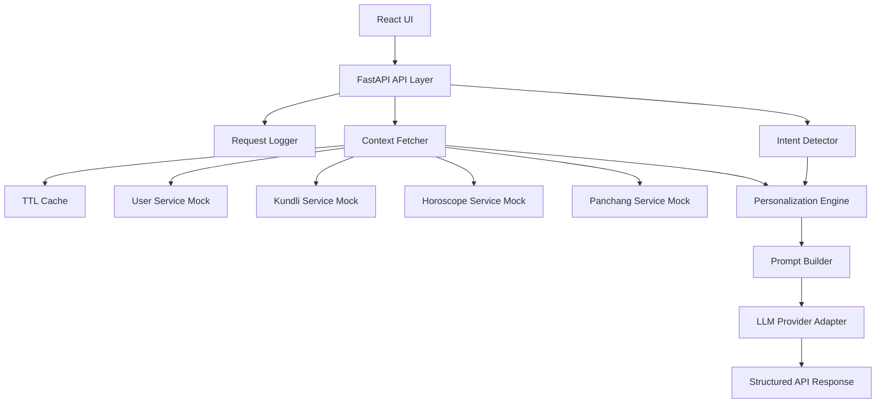

# MyNaksh Assessment - Project Overview

## Purpose

This project will implement a proof-of-concept Personalized AI Context Engine for MyNaksh.

The backend receives a user question, gathers astrology-related context from upstream services, selects only the relevant data, builds a personalized prompt, and generates a grounded answer through a configurable LLM provider.

The most important part of the project is the Personalization Engine. The UI and mock services exist mainly to demonstrate that the engine works end to end.

## Required User Flow

1. User enters `userId` and a question.
2. Backend fetches user, kundli, horoscope, and panchang data concurrently.
3. Backend detects intent: career, relationship, health, finance, general, and later timing/self-growth.
4. Personalization Engine selects relevant context.
5. Prompt builder creates an optimized prompt.
6. LLM provider generates a grounded answer.
7. API returns:

```json
{
  "answer": "...",
  "confidence": "HIGH",
  "sourcesUsed": ["Career Horoscope", "Current Dasha", "10th House"]
}
```

## System Components

### React UI

Small demo UI for:

- submitting questions
- viewing personalized answers
- viewing debug personalization decisions
- caching repeated requests in the browser

### FastAPI Backend

Responsible for:

- required API endpoints
- mock upstream service endpoints
- concurrent service fetching
- retries and timeouts
- caching
- personalization engine execution
- prompt construction
- LLM provider integration
- structured responses and errors

### Mock Upstream Services

The POC will mock:

- User Service
- Kundli Service
- Horoscope Service
- Panchang Service

Mocking over HTTP is intentional because it lets the backend still demonstrate realistic service behavior.

### Personalization Engine

Responsibilities:

- classify user intent
- select primary and secondary context
- exclude irrelevant context
- decide language, tone, and response length
- produce a debug-friendly internal plan

The engine is config-driven through JSON files under `backend/configs`.

### LLM Provider Layer

Supported modes:

- Mock provider
- OpenRouter
- LM Studio local models
- Generic OpenAI-compatible provider

## Architecture Diagram



## Main API Contracts

### `POST /personalize`

Generates the final answer using selected context and the configured LLM provider.

### `POST /debug/personalization`

Runs the engine but skips the LLM. This endpoint proves how the context decision was made.

### Mock service endpoints

```http
GET /mock/users/{userId}
GET /mock/kundli/{userId}
GET /mock/horoscope/{userId}
GET /mock/panchang
```

## POC Boundaries

In scope:

- Clean modular architecture
- Required endpoints
- Config-driven personalization
- Mock upstream services
- LLM provider flexibility
- In-memory backend cache
- Browser cache in UI
- Basic tests and docs

Out of scope for the first POC:

- Production authentication
- Distributed tracing
- Redis deployment
- Full MongoDB-backed admin panel
- Advanced semantic intent detection
- Provider-native JSON schemas for every model
- Queue-based async processing

## Current Implementation Status

Implemented:

- FastAPI backend skeleton with request logging middleware.
- Mock User, Kundli, Horoscope, and Panchang services.
- MongoDB-backed User, Kundli, Horoscope, and Panchang reads.
- MongoDB seed script with 10 linked users.
- Basic authN with salted password hashes and signed bearer tokens.
- RBAC with `admin` and `user` roles.
- Master admin user who can select any astrology user.
- Concurrent upstream fetching through async HTTP clients.
- Per-source timeout, retry, TTL cache, latency, and partial failure capture.
- JSON-config-driven Personalization Engine.
- Deterministic keyword intent detection for career, relationship, health, finance, and general.
- Context path resolution such as `kundli.houses.10`.
- Prompt builder that includes selected context only.
- Mock LLM, OpenRouter, and LM Studio/OpenAI-compatible providers.
- Request-level provider selection for mock, OpenRouter, LM Studio, or OpenAI-compatible LLMs.
- Required `/personalize` endpoint.
- Required `/debug/personalization` endpoint.
- React/Vite demo UI with browser-level `localStorage` cache.
- React controls for selecting mock vs MongoDB data and mock vs real LLM provider.
- React login/register flow and admin-only user dropdown.
- Dark canvas-neutral studio UI with nakshatra-style constellation preview, dynamic style gallery accents, core feature panels, and coming-soon local/OpenAI-compatible provider options.
- Rotating backend log file plus admin-only UI log console with manual refresh.
- Basic backend tests for engine and route contracts.

Implementation adjustment:

- The original plan suggested YAML. The implementation uses JSON config because the local Python 3.14 environment lacked compatible wheels for older `PyYAML` pins, and JSON keeps the POC dependency-light while preserving configuration-driven behavior.
- OpenRouter was configured locally with `openai/gpt-oss-120b`. One successful live `/personalize` smoke test was run after key parsing was corrected.
- Auth extension updated Mongo `_id` values to GUIDs and references to `userRefId`.
- Stripe Checkout is supported when Stripe keys and price IDs are configured; otherwise mock checkout keeps the POC runnable.

## Recommended First Demo Scenario

Request:

```json
{
  "userId": "user_101",
  "question": "Should I consider changing my job in the next few months?"
}
```

Expected engine interpretation:

```json
{
  "intent": "career",
  "selectedContext": [
    "Career Horoscope",
    "10th House",
    "Current Dasha",
    "Today's Panchang"
  ],
  "excludedContext": [
    "Relationship Horoscope"
  ],
  "language": "English",
  "tone": "Motivational",
  "maxWords": 250
}
```

Expected response shape:

```json
{
  "answer": "A concise, motivational, astrology-grounded career answer.",
  "confidence": "HIGH",
  "sourcesUsed": [
    "Career Horoscope",
    "10th House",
    "Current Dasha",
    "Today's Panchang"
  ]
}
```
